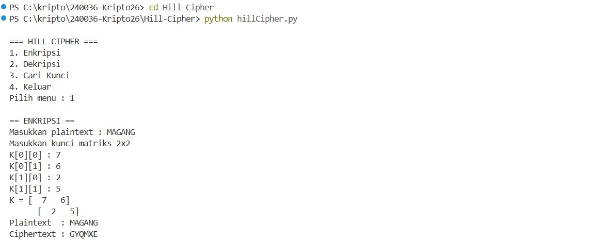
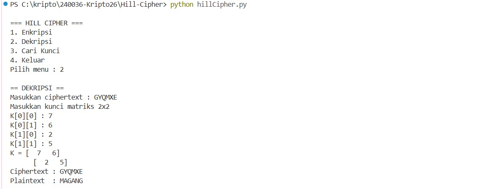
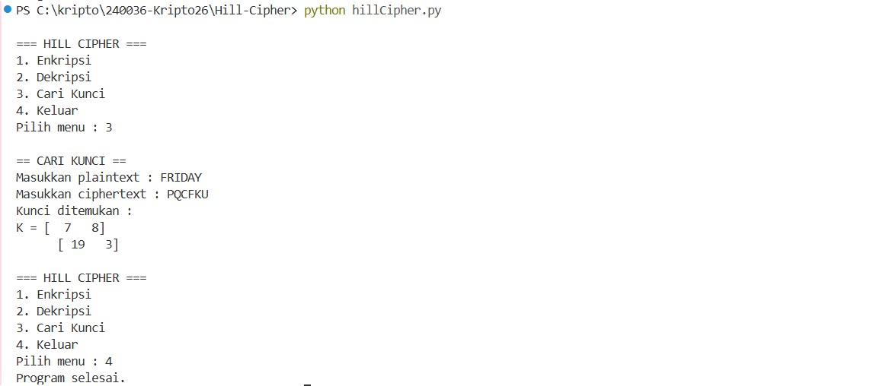

# Program Implementasi Hill Cipher (Matriks 2x2)

Program ini merupakan implementasi algoritma Kriptografi Klasik **Hill Cipher** berbasis matriks $2 \times 2$ menggunakan bahasa pemrograman Python. Program ini mendukung proses enkripsi, dekripsi, serta pencarian kunci (Known-Plaintext Attack).

---

## 1. Penjelasan Alur Program

Program bekerja berlandaskan aritmetika modulo 26 ($A=0, B=1, \dots, Z=25$) dengan alur fungsi sebagai berikut:

* **Pra-pemrosesan Teks (`prepare_text`)**:
  * Mengubah semua karakter huruf menjadi huruf kapital dan menghapus karakter selain alfabet.
  * Jika panjang teks ganjil, program secara otomatis menambahkan huruf padding `'X'` di akhir teks agar bisa dikelompokkan menjadi pasangan 2 huruf (blok $2 \times 1$).

* **Enkripsi (`hill_encrypt`)**:
  * Rumus Enkripsi: $C = (K \cdot P) \pmod{26}$
  * Teks dibagi menjadi pasangan huruf, diubah ke dalam vektor numerik $2 \times 1$, lalu dikalikan dengan matriks kunci $K$ ukuran $2 \times 2$ dalam modulo 26.

* **Dekripsi (`hill_decrypt`)**:
  * Rumus Dekripsi: $P = (K^{-1} \cdot C) \pmod{26}$
  * Program mencari invers dari matriks kunci $K^{-1}$ terlebih dahulu melalui langkah:
    1. Menghitung determinan matriks $K$.
    2. Mencari *multiplicative inverse* dari determinan terhadap modulo 26 (`mod_inverse`). Jika determinan tidak koprima dengan 26 ($\gcd(\det, 26) \neq 1$), program akan melempar *error* bahwa kunci tidak valid.
    3. Menghitung matriks adjoin dan mengalikannya dengan invers determinan.
  * Vektor ciphertext dikalikan dengan $K^{-1}$ modulo 26 untuk mengembalikan plainteks asli.

* **Pencarian Kunci (`find_key`)**:
  * Rumus Cari Kunci: $K = (C \cdot P^{-1}) \pmod{26}$
  * Menggunakan minimal 4 karakter pertama dari pasangan plainteks dan ciphertext untuk membentuk matriks $P$ dan $C$ ukuran $2 \times 2$.
  * Kunci $K$ diperoleh dengan mengalikan matriks $C$ dengan invers dari matriks $P$.

---

## 2. Screenshot Running Program

Berikut adalah hasil uji coba saat program dijalankan:

### 1. Uji Coba Enkripsi

### 2. Uji Coba Dekripsi

### 3. Uji Coba Pencarian Kunci
