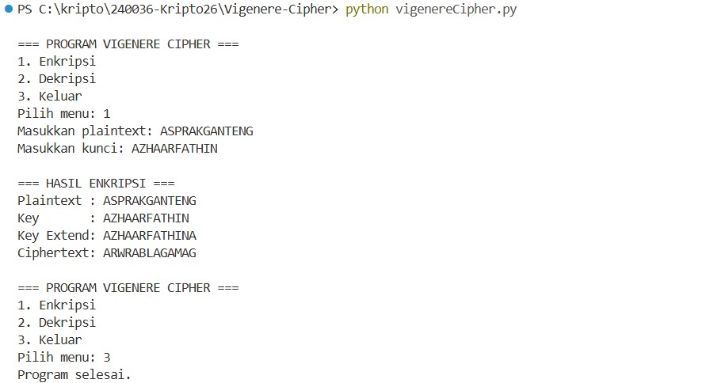
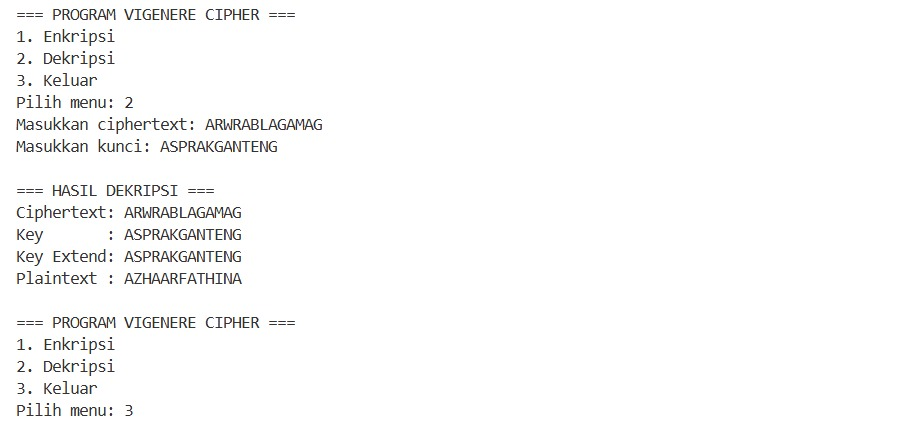

**# Program Implementasi Vigenère Cipher**

Program ini merupakan implementasi algoritma Kriptografi Klasik **Vigenère Cipher** (Polyalphabetic Substitution Cipher) menggunakan bahasa pemrograman Python. Program ini mendukung proses enkripsi dan dekripsi teks berbasis alfabet dengan input yang diberikan langsung oleh pengguna melalui menu program.

---

**## 1. Penjelasan Alur Program**

Program bekerja berlandaskan aritmetika modulo 26 ($A=0, B=1, \dots, Z=25$) dengan alur fungsi sebagai berikut:

* **Menu Utama**:

  * Pengguna dapat memilih proses yang ingin dilakukan, yaitu **Enkripsi**, **Dekripsi**, atau **Keluar**.
  * Pada proses enkripsi dan dekripsi, pengguna memasukkan teks dan kunci secara manual.

* **Pra-pemrosesan Teks (`clean_text`)**:

  * Mengubah semua karakter huruf menjadi huruf kapital (*uppercase*) dan menghapus karakter non-alfabet (seperti spasi, angka, dan simbol).

* **Perpanjangan Kunci (`extend_key`)**:

  * Menyesuaikan panjang kunci dengan panjang plainteks.
  * Jika panjang kunci lebih pendek dari plainteks, kunci akan diulang secara berurutan (*repeat*) hingga memiliki panjang yang sama dengan plainteks.

* **Enkripsi (`vigenere_encrypt`)**:

  * Rumus Enkripsi: $C_i = (P_i + K_i) \pmod{26}$
  * Setiap karakter plainteks ($P_i$) diubah menjadi nilai numerik, lalu ditambahkan dengan nilai numerik karakter kunci yang seletak ($K_i$). Hasil penjumlahan dihitung dalam modulo 26 dan dikonversi kembali menjadi karakter *ciphertext*.

* **Dekripsi (`vigenere_decrypt`)**:

  * Rumus Dekripsi: $P_i = (C_i - K_i + 26) \pmod{26}$
  * Setiap karakter *ciphertext* ($C_i$) dikurangi dengan nilai numerik karakter kunci yang seletak ($K_i$). Hasil pengurangan ditambah 26 lalu dihitung dalam modulo 26 untuk mengembalikan karakter plainteks asli.

---

**## 2. Screenshot Running Program**

Berikut adalah hasil uji coba saat program dijalankan:

**### 1. Uji Coba Enkripsi**

**### 2. Uji Coba Dekripsi**

